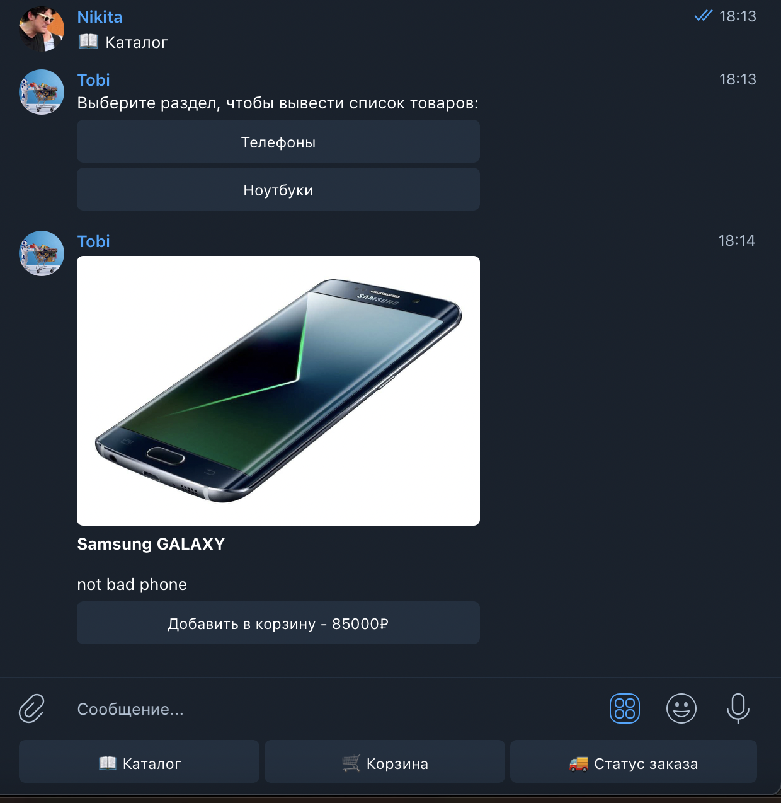
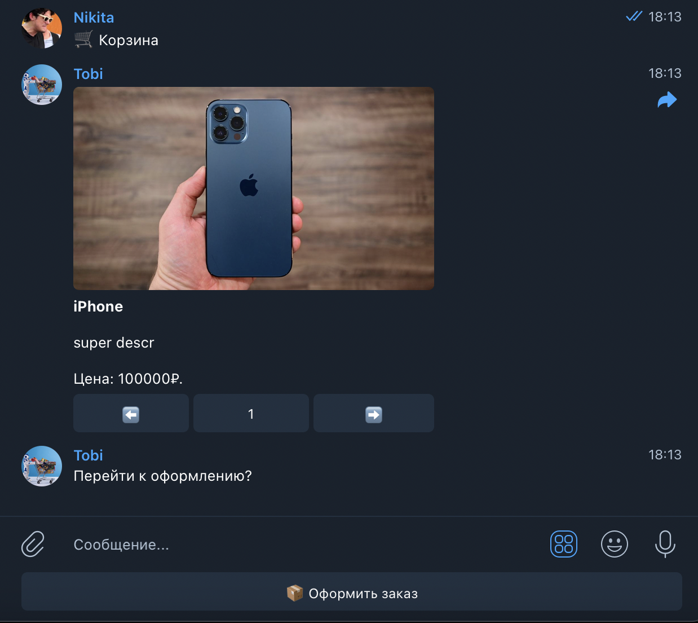
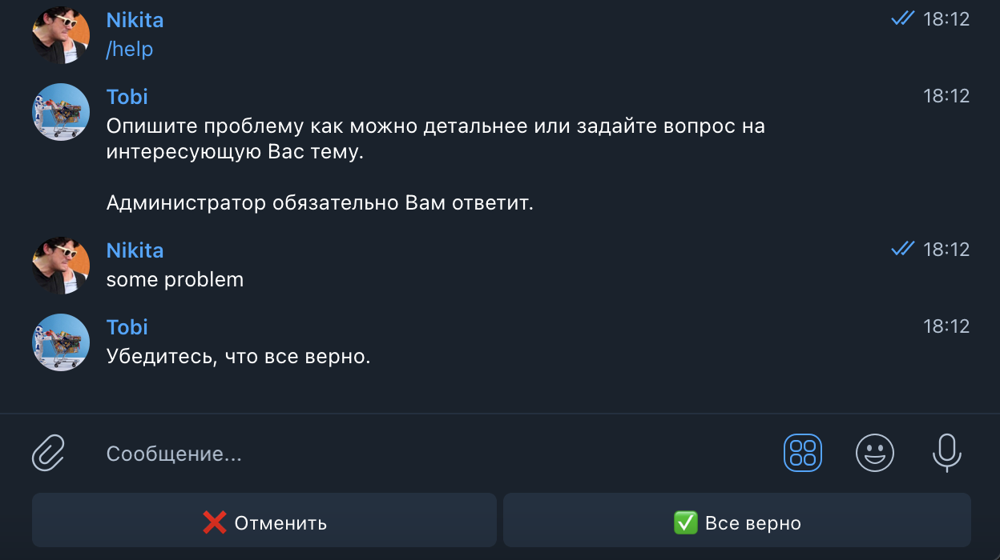

### Telegram shop-bot template

## Functional
- ```/start``` – to start bot and choose user's or admin's mode;
- ```/menu``` – to open menu;
- ```/help``` – to ask questions for admins.

## Menu

### User's menu:


### Catalog:


### Cart:


### /help:


### Admin's menu:


### Admin's settings:


## How to use:

### 1. Setup virtual environment
```
python3 -m venv .venv
source .venv/bin/activate
```
### 2. Install packages
```
pip3 install -r requirements.txt
```

### 3. Input.py
Add your bot's token and admin's id to input.py

### 4. Run bot
```
python3 main.py
```